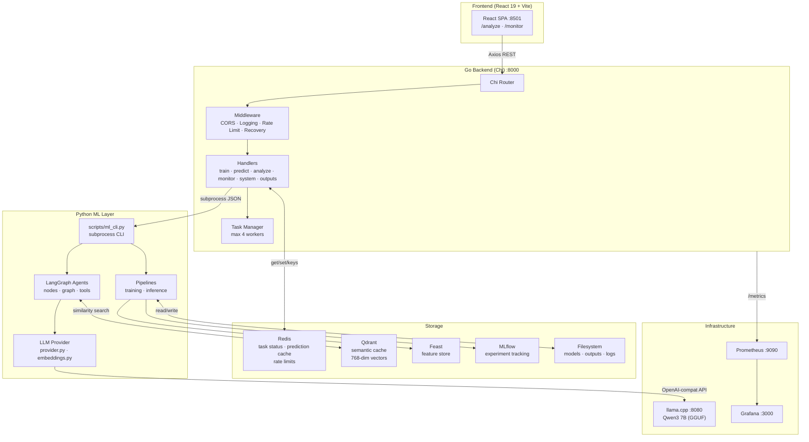
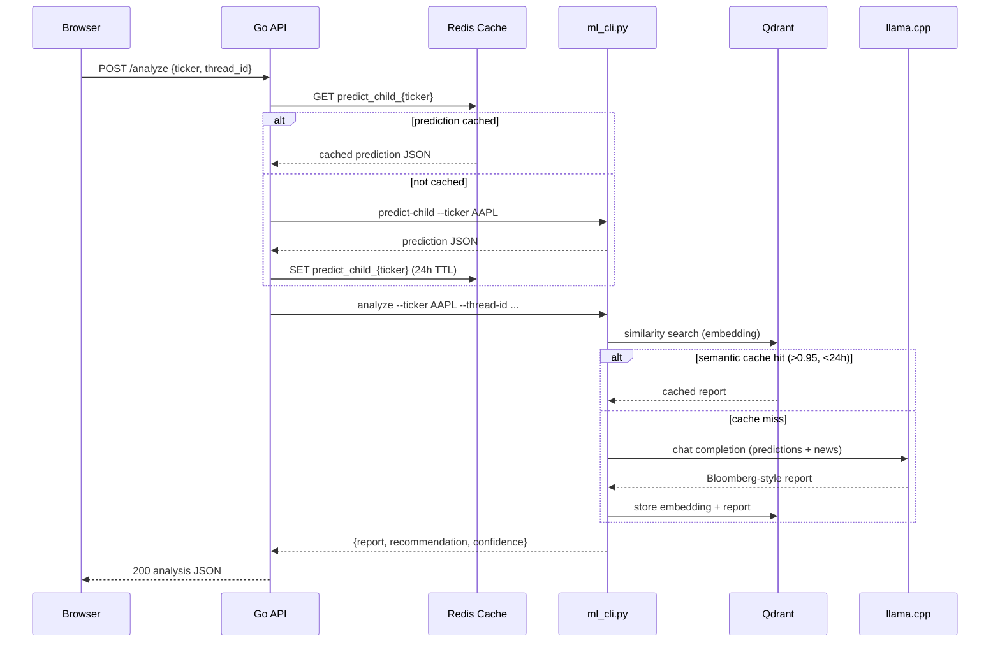
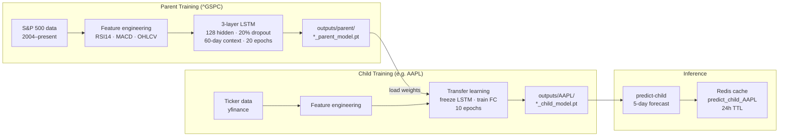

# Stock Agent Ops

End-to-end stock market prediction and analysis system using transfer learning (LSTM) and agentic AI (LangGraph).

A **Go API** orchestrates Python ML pipelines, serves predictions with Redis caching, and generates Bloomberg-style analysis reports via a local LLM (Qwen3 7B on llama.cpp). A **React SPA** provides the frontend for analysis and monitoring.

---

## Architecture

### System Overview



### Analyze Request Flow



### ML Training & Transfer Learning



---

## Tech Stack

| Component | Technology |
|:---|:---|
| Backend | Go 1.22 (Chi router) |
| ML Models | PyTorch LSTM (transfer learning) |
| LLM | llama.cpp (Qwen3 7B, Q4_K_M GGUF) |
| AI Agents | LangGraph + LangChain (OpenAI-compat client) |
| Feature Store | Feast (offline: Parquet, online: Redis) |
| Experiment Tracking | MLflow (local or DagsHub) |
| Semantic Cache | Qdrant (768-dim vectors, 24h TTL) |
| Prediction Cache | Redis (24h TTL) |
| Monitoring | Prometheus + Grafana |
| Frontend | React 19 + Vite 6 + TypeScript + Tailwind CSS v4 |
| Deployment | Docker Compose / Kubernetes (Minikube) |

---

## Quick Start

### Prerequisites

- [Docker & Docker Compose](https://docs.docker.com/get-docker/)
- [Finnhub API key](https://finnhub.io/) (free tier works)
- ~5 GB disk space for the LLM model

### 1. Clone

```bash
git clone https://github.com/ShrithikShahapure/stock-agent-ops.git
cd stock-agent-ops
```

### 2. Download LLM Model

```bash
mkdir -p models

# Qwen3 7B Q4_K_M (~4.4 GB, recommended)
wget -O models/qwen3-7b-q4_k_m.gguf \
  https://huggingface.co/Qwen/Qwen2.5-7B-Instruct-GGUF/resolve/main/qwen2.5-7b-instruct-q4_k_m.gguf
```

> **Alternately** use Gemma 3 by downloading a compatible GGUF and setting `LLM_MODEL=gemma3` in `.env`.

### 3. Configure Environment

```bash
cp .env.example .env
```

Edit `.env` and add at minimum:

```
FMI_API_KEY=your_finnhub_api_key
```

Optional (for remote experiment tracking):
```
DAGSHUB_USER_NAME=
DAGSHUB_REPO_NAME=
DAGSHUB_TOKEN=
MLFLOW_TRACKING_URI=
```

### 4. Start

```bash
./run_docker.sh
```

Or directly:

```bash
docker-compose up --build -d
```

### 5. Access

| Service | URL | Credentials |
|:---|:---|:---|
| React Frontend | http://localhost:8501 | — |
| API Docs (Swagger) | http://localhost:8000/docs | — |
| Grafana | http://localhost:3000 | admin / admin |
| Prometheus | http://localhost:9090 | — |
| llama.cpp | http://localhost:8080/v1 | — |
| Redis Insight | http://localhost:8001 | — |

---

## API Endpoints

### Training

```bash
# Train parent model (S&P 500)
curl -X POST http://localhost:8000/train-parent

# Train child model (transfer learning from parent)
curl -X POST http://localhost:8000/train-child \
  -H "Content-Type: application/json" \
  -d '{"ticker":"AAPL"}'

# Check training status
curl http://localhost:8000/status/aapl
```

### Prediction

```bash
# Predict with child model (auto-trains if model missing)
curl -X POST http://localhost:8000/predict-child \
  -H "Content-Type: application/json" \
  -d '{"ticker":"AAPL"}'

# Predict with parent model
curl -X POST http://localhost:8000/predict-parent
```

### Analysis (LLM Agent)

```bash
# Full Bloomberg-style analysis
curl -X POST http://localhost:8000/analyze \
  -H "Content-Type: application/json" \
  -d '{"ticker":"AAPL"}'
```

### Monitoring

```bash
# Drift detection + agent evaluation (parent)
curl -X POST http://localhost:8000/monitor/parent

# Per-ticker monitoring
curl -X POST http://localhost:8000/monitor/AAPL

# View drift report
curl http://localhost:8000/monitor/AAPL/drift

# View agent evaluation
curl http://localhost:8000/monitor/AAPL/eval
```

### System

```bash
curl http://localhost:8000/health
curl http://localhost:8000/outputs
curl http://localhost:8000/system/logs?lines=50
curl http://localhost:8000/system/cache
curl http://localhost:8000/metrics
curl -X DELETE http://localhost:8000/system/reset
```

Rate limits: 5/hour for training endpoints, 40/hour for predictions.

---

## MLOps

This project is MLOps-first. Every stage of the ML lifecycle is instrumented.

| Concern | Implementation |
|:---|:---|
| **Feature store** | Feast — offline Parquet + online Redis; prevents training-serving skew |
| **Experiment tracking** | MLflow — params, metrics (MSE/RMSE/R²), artifacts (model, scaler, plots), model registry with Production promotion |
| **Data drift detection** | Custom Z-score mean-shift per feature + volatility ratio; three health levels (Healthy / Degraded / Critical) |
| **Agent evaluation** | Heuristic checks on LLM output (relevance, trustworthiness, recommendation presence); scored 0–1 |
| **Prediction caching** | Redis (`predict_child_{ticker}`, 24h TTL) — cache hit/miss tracked in Prometheus |
| **Semantic caching** | Qdrant (768-dim cosine, threshold 0.95, 24h TTL) — avoids redundant LLM calls |
| **Serving observability** | Prometheus metrics: training status/duration/MSE, prediction latency/count, cache hit rate, system resources |
| **Auto-healing** | Missing model → background training triggered automatically; Redis/MLflow/Feast failures are non-fatal |
| **Async task management** | Go background worker pool (max 4), Redis-backed status, 2h timeout |

See [doc/mlops.md](doc/mlops.md) for the full MLOps reference: pipeline details, feature store workflow, drift thresholds, agent eval scoring, metric catalogue, artifact layout, and end-to-end sequence diagrams.

---

## How Transfer Learning Works

The parent model learns general market dynamics from the S&P 500. Child models inherit those weights and fine-tune on individual tickers, needing far less data and fewer epochs.

**Model architecture:** 3-layer LSTM (128 hidden units, 20% dropout) → FC output layer.
**Input features:** Open, High, Low, Close, Volume, RSI14, MACD (7 features).
**Context window:** 60 trading days. **Forecast horizon:** 5 business days.

---

## How AI Analysis Works

When you call `/analyze`, the pipeline:

1. **Checks Redis** for a cached prediction (TTL 24h)
2. **Checks Qdrant** for a semantically similar cached report (cosine similarity > 0.95, < 24h old)
3. **Fetches latest news** from Finnhub (falls back to Yahoo Finance)
4. **Calls Qwen3 7B** (via llama.cpp) with predictions + news → Bloomberg-style report
5. **Caches the result** in Qdrant with embeddings for future lookups

The report includes a **Market Stance** (BULLISH / BEARISH / NEUTRAL) and **Confidence** level.

---

## Project Structure

```
cmd/server/                  Go entrypoint
internal/
  config/                    Environment-based configuration
  handlers/                  HTTP handlers (health, train, predict, analyze, monitor, system, outputs)
  http/                      Chi router + server setup
  metrics/                   Prometheus metrics (mirrors Grafana dashboards)
  middleware/                CORS, logging, rate limiting, panic recovery
  models/                    Request/response structs
  services/
    cache/                   Redis prediction cache (24h TTL)
    python/                  Python CLI subprocess runner
    redis/                   Redis client wrapper
    tasks/                   Background task manager (max 4 workers)

src/
  agents/                    LangGraph agent (graph.py), nodes, tools
  data/                      Data ingestion (yfinance) and feature preparation (PyTorch datasets)
  llm/                       LLM provider abstraction (llama.cpp primary, Ollama fallback)
  memory/                    Qdrant semantic cache
  model/                     LSTM definition, training, evaluation, saving
  monitoring/                Drift detection (Evidently), agent evaluation
  pipelines/                 Training pipeline (parent/child), inference pipeline

scripts/
  ml_cli.py                  Python CLI called by Go (train, predict, analyze, monitor)
  smoke.sh                   Endpoint smoke tests

frontend/                    React 19 + Vite 6 SPA (port 8501)
  src/
    api/                     Axios modules (analyze, train, predict, monitor, system)
    components/              AppShell, NavBar, AnalysisPage, MonitorPage, common UI
    hooks/                   usePolling, useAnalysis, useTraining, useMonitor
    types/                   TypeScript API contracts
  Dockerfile                 Multi-stage: node:20-alpine → nginx:alpine
  nginx.conf                 SPA fallback, /healthz endpoint
  docker-entrypoint.sh       Injects runtime API_URL into config.js

feature_store/               Feast config and feature definitions
k8s/                         Kubernetes manifests (api, llama, redis, qdrant, prometheus, grafana, frontend)
prometheus/                  Prometheus scrape config
doc/                         System design, API baseline, deployment docs
```

---

## Kubernetes Deployment

```bash
./run_k8s.sh
```

Starts Minikube, builds images, deploys all services, and waits for readiness. Run `sudo minikube tunnel` in a separate terminal for LoadBalancer access.

---

## Smoke Tests

```bash
./scripts/smoke.sh              # defaults to localhost:8000
./scripts/smoke.sh http://your-host:8000
```

---

## Environment Variables

| Variable | Default | Description |
|:---|:---|:---|
| `PORT` | `8000` | Go API server port |
| `REDIS_HOST` | `localhost` | Redis hostname |
| `REDIS_PORT` | `6379` | Redis port |
| `QDRANT_HOST` | `qdrant` | Qdrant hostname |
| `QDRANT_PORT` | `6333` | Qdrant port |
| `LLAMA_CPP_BASE_URL` | — | llama.cpp OpenAI-compat URL (e.g. `http://llama:8080/v1`) |
| `LLM_MODEL` | `qwen3-7b` | Model name passed to llama.cpp |
| `PYTHON_TIMEOUT` | `120` | Timeout (s) for short Python CLI calls |
| `TRAINING_TIMEOUT` | `7200` | Timeout (s) for training jobs |
| `FMI_API_KEY` | — | Finnhub API key for news |
| `MLFLOW_TRACKING_URI` | — | MLflow tracking server (optional) |
| `DAGSHUB_USER_NAME` | — | DagsHub username (optional) |
| `DAGSHUB_REPO_NAME` | — | DagsHub repo name (optional) |
| `DAGSHUB_TOKEN` | — | DagsHub token (optional) |
| `API_URL` | `http://localhost:8000` | Browser-accessible API URL (frontend runtime config) |

---

## License

MIT
