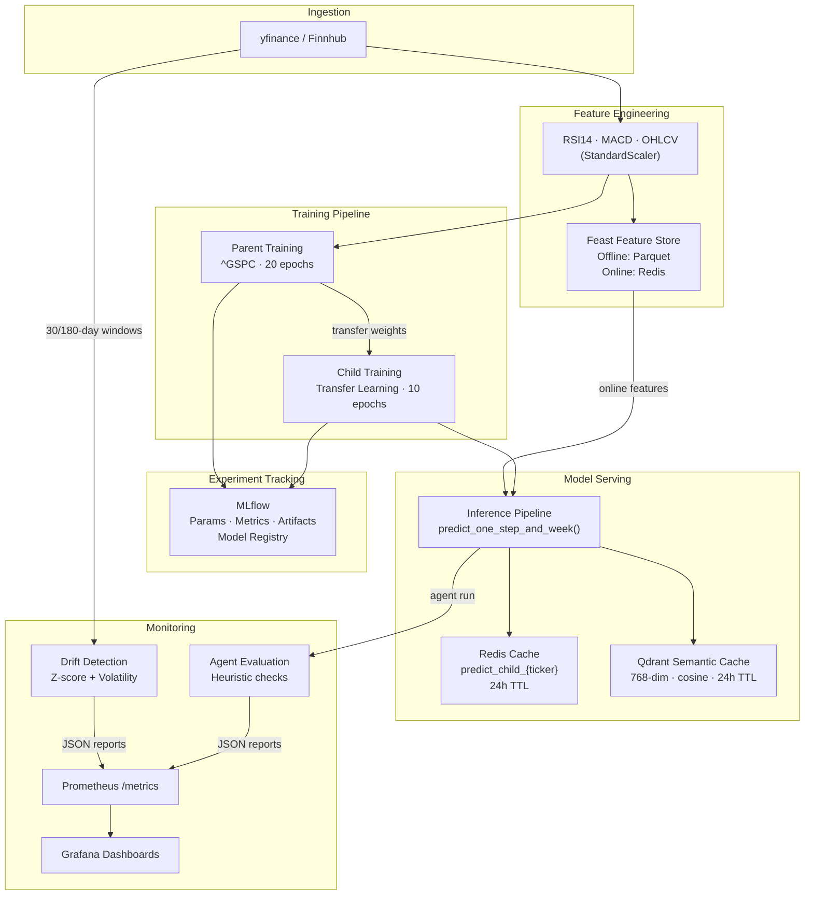
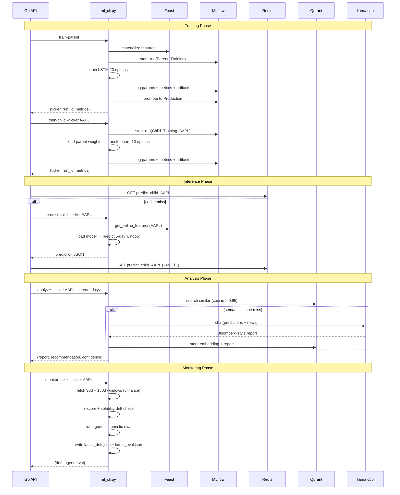

# MLOps Architecture — Stock Agent Ops

This document describes every MLOps component in the system: how data flows through the pipeline, how models are trained and tracked, how drift is detected, how agents are evaluated, and how all of this is observable at runtime.

---

## Table of Contents

1. [Overview](#overview)
2. [ML Pipeline](#ml-pipeline)
3. [Feature Store (Feast)](#feature-store-feast)
4. [Experiment Tracking (MLflow)](#experiment-tracking-mlflow)
5. [Model Serving & Caching](#model-serving--caching)
6. [Drift Detection](#drift-detection)
7. [Agent Evaluation](#agent-evaluation)
8. [Observability (Prometheus + Grafana)](#observability-prometheus--grafana)
9. [Auto-Healing & Resilience](#auto-healing--resilience)
10. [Output Artifact Layout](#output-artifact-layout)
11. [End-to-End Data Flow](#end-to-end-data-flow)

---

## Overview



---

## ML Pipeline

### Model Architecture

| Parameter | Value |
|:---|:---|
| Architecture | 3-layer LSTM + FC output head |
| Hidden size | 128 units per layer |
| Dropout | 20% |
| Input features | 7 (Open, High, Low, Close, Volume, RSI14, MACD) |
| Context window | 60 trading days |
| Forecast horizon | 5 business days |
| Normalisation | StandardScaler (fit on training split) |

### Parent Training (`train_parent`)

Trains the base model on S&P 500 data from 2004 to present. This model learns broad market dynamics — trend patterns, volatility regimes, and feature correlations — that are shared across individual equities.

```
Input:  ^GSPC OHLCV from 2004-08-19 → today
Split:  80% train / 20% validation (random split)
Epochs: 20   LR: 1e-3   Batch: 32
Output: outputs/parent/^GSPC_parent_model.pt
        outputs/parent/^GSPC_parent_scaler.pkl
```

### Child Training (`train_child`) — Transfer Learning

Loads the parent weights and specialises the model for an individual ticker. Two transfer strategies are supported via `TRANSFER_STRATEGY` config:

| Strategy | LSTM Layers | FC Head | Learning Rate | Use Case |
|:---|:---|:---|:---|:---|
| `freeze` (default) | Frozen | Trained | 3e-4 | Fast, data-efficient; best for liquid, correlated stocks |
| `fine_tune` | Trainable | Trained | 1e-4 (lower) | Higher accuracy; better for tickers with unique dynamics |

```
Input:  Parent weights + ticker OHLCV from 2004-08-19 → today
Split:  80% train / 20% validation
Epochs: 10   Strategy: freeze (default) or fine_tune
Output: outputs/{ticker}/{ticker}_child_model.pt
        outputs/{ticker}/{ticker}_child_scaler.pkl
```

### Why Transfer Learning?

Individual stock tickers often lack the volume of data needed to train a reliable LSTM from scratch. By transferring the S&P 500 parent's learned representations:
- Child models converge in **half the epochs** (10 vs 20)
- Performance is more stable on tickers with shorter histories
- Market-wide features (volatility, trend structure) are pre-learned

---

## Feature Store (Feast)

Feast provides a consistent feature interface between the offline training environment and the online inference environment, preventing training-serving skew.

### Configuration

```python
# feature_store/features.py
Entity:       ticker (string join key)
Feature View: stock_stats
  - Open, High, Low, Close, Volume  (Float32)
  - RSI14, MACD                      (Float32)
  TTL: 36500 days (effectively permanent history)

Offline store: feature_store/data/features.parquet
Online store:  Redis (same instance as prediction cache)
```

### Workflow

```
1. fetch_ohlcv() downloads raw OHLCV + computes RSI14/MACD
2. Data is written to the Parquet offline store
3. feast materialize materialises features to Redis online store
4. predict_parent() / predict_child() call store.get_online_features()
   to retrieve the latest feature vector at inference time
```

### Materialise Features

```bash
cd feature_store
feast apply          # register entities and feature views
feast materialize-incremental $(date -u +"%Y-%m-%dT%H:%M:%S")
```

> **Note:** Feature store reads are best-effort — if Feast is unavailable, the pipeline falls back to fetching directly from yfinance without interrupting predictions.

---

## Experiment Tracking (MLflow)

Every training run is tracked in MLflow. The system works with a local tracking server (default) or a remote DagsHub instance.

### What Gets Tracked

| Category | Details |
|:---|:---|
| **Parameters** | context_len, pred_len, features list, batch_size, start_date, epochs, input_size, parent_ticker |
| **Metrics** | MSE, RMSE, R² (evaluated on full dataset after training) |
| **Artifacts** | `.pt` model file, `.pkl` scaler, `{ticker}_predictions.png`, `{ticker}_residuals.png`, `{ticker}_metrics.json` |
| **Model Registry** | Registered model promoted to `Production` stage after successful run |

### Evaluation Metrics

Post-training evaluation runs on the full dataset (not just the validation split) across all 5 OHLCV dimensions:

| Metric | Description |
|:---|:---|
| MSE | Mean Squared Error on normalised OHLCV predictions |
| RMSE | Root MSE — same units as price (after inverse scaling) |
| R² | Coefficient of determination; 1.0 = perfect, < 0 = worse than mean |

Plots generated per run:
- **Predictions vs Actuals** — 5-panel plot (one per OHLCV feature)
- **Residuals** — residual time series per feature with zero-line reference

### Local vs Remote Tracking

```bash
# Local (default — stores under mlruns/)
MLFLOW_TRACKING_URI=

# Remote via DagsHub
MLFLOW_TRACKING_URI=https://dagshub.com/{user}/{repo}.mlflow
DAGSHUB_USER_NAME=your_username
DAGSHUB_REPO_NAME=your_repo
DAGSHUB_TOKEN=your_token
```

```bash
# View local MLflow UI
mlflow ui --backend-store-uri ./mlruns
# Open http://localhost:5000
```

> MLflow is optional — training completes successfully even if MLflow is unavailable. All errors during logging are caught and warned, never fatal.

---

## Model Serving & Caching

### Inference Pipeline

`predict_one_step_and_week()` produces two outputs per call:
- **Next-day prediction** — single-step forecast
- **5-day forecast** — multi-step rolling prediction

Both are returned alongside the last 30 days of historical closes for frontend chart rendering.

### Redis Prediction Cache

```
Key:   predict_child_{ticker}    (e.g. predict_child_AAPL)
TTL:   86400 seconds (24 hours)
Value: Full prediction JSON (next-day + 5-day forecast + history)
```

Cache logic in the Go handler:
1. `GET predict_child_{ticker}` → return cached result immediately (cache hit)
2. On miss → invoke `ml_cli.py predict-child --ticker AAPL`
3. `SET predict_child_{ticker}` with 24h TTL

Prometheus tracks `redis_cache_hit_total{key}` and `redis_cache_miss_total{key}`.

### Qdrant Semantic Cache

Analysis reports are cached by semantic similarity to avoid re-running the LLM on equivalent queries.

```
Collection: stock_analysis
Embedding:  nomic-embed-text (768-dim) via llama.cpp embeddings endpoint
Similarity: Cosine, threshold > 0.95
Filter:     ticker == requested_ticker AND timestamp < 24h ago
```

Cache lookup flow:
1. Embed the incoming query (ticker + context)
2. Search Qdrant for nearest neighbour above threshold
3. Hit → return cached report immediately, skip LLM call
4. Miss → run LLM, store result + embedding in Qdrant

---

## Drift Detection

Drift is checked via `POST /monitor/parent` or `POST /monitor/{ticker}`. The system uses a custom statistical approach — no external dependency on Evidently or similar libraries.

### Two Detection Methods

#### 1. Data Drift — Z-Score Mean Shift

Measures how much each feature's mean has shifted between a 150-day reference window and a 30-day current window.

```
Reference:  [180 days ago → 30 days ago]  (150 trading days)
Current:    [30 days ago → today]          (≈22 trading days)

For each feature f:
  shift_score(f) = |mean_curr(f) - mean_ref(f)| / (std_ref(f) + ε)

avg_drift = mean(shift_score across all features)
```

#### 2. Concept Drift — Volatility Ratio

Measures whether the underlying return distribution has changed, which would invalidate learned patterns.

```
ref_vol  = std(Close.pct_change()) over reference window
curr_vol = std(Close.pct_change()) over current window
vol_ratio = curr_vol / ref_vol
```

### Health Thresholds

| Status | avg_drift | vol_ratio |
|:---|:---|:---|
| **Healthy** | < 1.0 | 0.6 – 1.5 |
| **Degraded (Warning)** | 1.0 – 2.0 | 1.5 – 2.5 or < 0.6 |
| **Critical (Drift Detected)** | > 2.0 | > 2.5 or < 0.4 |

### Output

```json
// outputs/{ticker}/drift/latest_drift.json
{
  "health": "Healthy",
  "drift_score": 0.423,
  "volatility_index": 1.12,
  "feature_metrics": {
    "Close": { "ref_mean": 512.3, "curr_mean": 498.1, "shift_score": 0.31 },
    "Volume": { "ref_mean": 2.1e9, "curr_mean": 2.4e9, "shift_score": 0.58 }
  },
  "timestamp": "2026-02-19T12:34:56"
}
```

Retrievable via `GET /monitor/{ticker}/drift`.

---

## Agent Evaluation

After each monitor run, `AgentEvaluator.evaluate_live()` triggers a fresh agent call and scores the output against three heuristic checks. No external LLM-as-judge or LangSmith dependency.

### Heuristic Checks

| Check | Criterion | Method |
|:---|:---|:---|
| **Relevance** | Report mentions the requested ticker | `ticker.lower() in text.lower()` |
| **Trustworthiness** | Report cites sources and contains numeric data | Keywords: "source", "according to", "news", "report", "data" + digit present |
| **Has Recommendation** | Report contains a directional stance | Keywords: "bullish", "bearish", "neutral", "buy", "sell", "hold" |

```python
overall_score = passed_checks / total_checks   # 0.0 – 1.0
status = "Trustworthy" if overall_score > 0.6 else "Questionable"
```

### Output

```json
// outputs/{ticker}/agent_eval/latest_eval.json
{
  "ticker": "AAPL",
  "metrics": {
    "checks": {
      "relevance": true,
      "trustworthiness": true,
      "has_recommendation": true
    },
    "overall_score": 1.0,
    "status": "Trustworthy",
    "duration_seconds": 4.23,
    "timestamp": "2026-02-19T12:34:56"
  },
  "output_preview_text": "Apple Inc. (AAPL) shows strong..."
}
```

Retrievable via `GET /monitor/{ticker}/eval`. Historical snapshots are saved alongside as `eval_{unix_ts}.json`.

---

## Observability (Prometheus + Grafana)

The Go backend exposes `GET /metrics` in Prometheus text format. Grafana scrapes this for dashboards.

### Metric Catalogue

| Metric | Type | Labels | Description |
|:---|:---|:---|:---|
| `system_cpu_percent` | Gauge | — | Host CPU utilisation |
| `system_ram_used_mb` | Gauge | — | Host RAM used (MB) |
| `system_disk_used_mb` | Gauge | — | Host disk used (MB) |
| `redis_up` | Gauge | — | Redis connectivity (1=up, 0=down) |
| `redis_keys_total` | Gauge | — | Total keys in Redis |
| `training_status` | Gauge | `task_id` | 0=idle, 1=running, 2=completed |
| `training_mse_last` | Gauge | — | MSE from the most recent training run |
| `training_duration_seconds` | Histogram | `task_id` | Training wall-clock time (exponential buckets 1s–9h) |
| `prediction_total` | Counter | `type` | Cumulative prediction requests (`parent`/`child`) |
| `prediction_latency_seconds` | Histogram | `type` | End-to-end prediction latency |
| `redis_cache_hit_total` | Counter | `key` | Prediction cache hits per key prefix |
| `redis_cache_miss_total` | Counter | `key` | Prediction cache misses per key prefix |

### Access

```bash
curl http://localhost:8000/metrics   # raw Prometheus text
open http://localhost:9090           # Prometheus UI
open http://localhost:3000           # Grafana (admin / admin)
```

---

## Auto-Healing & Resilience

The Go task manager implements several self-healing behaviours to keep predictions available even when models haven't been explicitly trained.

| Trigger | Behaviour |
|:---|:---|
| `POST /predict-child` — child model missing | Returns `202 Training` + auto-starts `train-child` in background |
| `POST /train-child` — parent model missing | Auto-starts `train-parent` first, then chains `train-child` on completion |
| `POST /predict-child` — parent model missing | Same chain as above |
| Redis unavailable at startup | Server starts in degraded mode; caching and rate limiting disabled, all other endpoints functional |
| MLflow unavailable | Training completes; all MLflow calls are silently skipped |
| Feast unavailable | Inference completes; online feature fetch is skipped, raw yfinance data used directly |
| llama.cpp unavailable | Provider falls back to Ollama; if neither available, returns mock LLM client |
| Qdrant unavailable | Semantic cache disabled; every `/analyze` call hits the LLM directly |

### Task Manager

```
Max concurrent workers:  4
Status key format:       task_status:{task_id}   (Redis)
TTL — running:           7200s (2h)
TTL — completed/failed:  3600s (1h)
Prediction cache TTL:    86400s (24h)
```

Task status is queryable at `GET /status/{task_id}` (use `parent` as task_id for the parent training job).

---

## Output Artifact Layout

All ML artifacts are written under `outputs/` (mounted into the container at `/app/outputs`):

```
outputs/
  parent/
    ^GSPC_parent_model.pt        # PyTorch state dict
    ^GSPC_parent_scaler.pkl      # Fitted StandardScaler
    ^GSPC_metrics.json           # MSE, RMSE, R² from last eval
    ^GSPC_predictions.png        # Actual vs predicted (OHLCV)
    ^GSPC_residuals.png          # Residual plot (OHLCV)

  {ticker}/                      # e.g. AAPL/
    {ticker}_child_model.pt
    {ticker}_child_scaler.pkl
    {ticker}_metrics.json
    {ticker}_predictions.png
    {ticker}_residuals.png

    drift/
      latest_drift.json          # Most recent drift report
    agent_eval/
      latest_eval.json           # Most recent agent eval
      eval_{unix_ts}.json        # Timestamped history
```

The `/outputs` and `/outputs/{ticker}` API endpoints expose these files with category grouping (models, scalers, metrics, plots, drift, eval).

---

## End-to-End Data Flow


